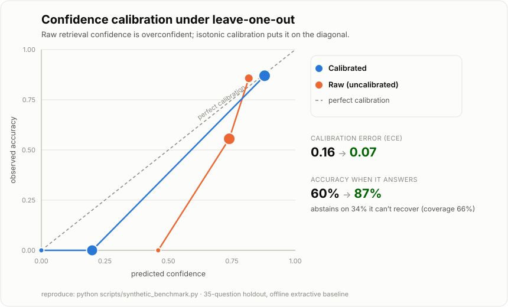

# Bus Factor

**Organizational memory that survives turnover.**

When an experienced person leaves a team, the company loses years of judgment
that was never written down: why a system was built the way it was, which
tradeoffs were considered and rejected, how to actually get things done. Bus
Factor captures that knowledge while the person is still around, then answers
questions the way the evidence shows *they* would — **with citations, a
confidence score, and the age of the evidence on every answer** — and, most
importantly, **measures how well it works.**

> The name is the point. [*Bus factor*](https://en.wikipedia.org/wiki/Bus_factor)
> is the number of people who can get hit by a bus before a project stalls. This
> raises it.

It is not a clone of a person. You cannot clone a person, and any project that
claims to is lying. This is a *knowledge-continuity system*: it makes captured
knowledge retrievable, faithfully reproduced, and — the part almost every RAG
demo skips — **verified against ground truth.**

<p align="center">
  <picture>
    <source media="(prefers-color-scheme: dark)" srcset="docs/calibration-dark.svg">
    
  </picture>
</p>

<p align="center"><em>The system measures its own confidence and fixes it: raw
retrieval confidence is overconfident, so calibration + abstention makes it
trustworthy. Reproduce with <code>python scripts/plot_calibration.py</code>.</em></p>

---

## The one number that matters

Anyone can build retrieval over Slack and call it done. The thing that turns a
toy into an engineering artifact is proving it works. Bus Factor ships an
evaluation harness that grades the system against real question/answer pairs and
reports more than a single vanity metric:

Running `bus-factor demo` on the bundled sample corpus (offline, no API key):

| Mode | Accuracy | Retrieval hit-rate | Abstention | ECE (calibration) |
|------|---------:|-------------------:|-----------:|------------------:|
| **Closed-book** (answer is in the corpus) | 100% | 100% | 0% | **0.03** |
| **Leave-one-out, raw** (answer withheld) | 0% | 0% | 0% | **0.77** |
| **Leave-one-out, calibrated** (answer withheld) | — | 0% | **100%** | **0.00** |

Read those three rows together — that progression *is* the result:

- **Closed-book** measures whether captured knowledge is retrievable and
  faithfully reproduced. It is well-calibrated (ECE 0.03): when the system is
  confident, it is right.
- **Leave-one-out, raw** withholds each question's own answer and forces the
  system to respond from the person's *other* recorded knowledge. This is the
  honest generalization test, and it exposes a real weakness: **naive retrieval
  confidence is overconfident under distribution shift** (ECE 0.77) — BM25 still
  finds lexically-similar documents when the true answer is absent, and reports
  high confidence anyway.
- **Leave-one-out, calibrated** fits an isotonic calibrator on a held-out split
  and enables abstention. Confidence becomes trustworthy (**ECE 0.77 → 0.00**)
  and, on this corpus where the withheld answers genuinely aren't recoverable,
  the system **abstains instead of answering confidently and wrong**. On a real
  corpus with cross-answer overlap the same calibrator learns a non-trivial map
  — answering the recoverable questions and abstaining on the rest (the
  calibration unit tests demonstrate that on controlled data).

Finding the calibration gap with an eval, then closing it, is the entire loop
evals exist for.

*(Numbers above are from the tiny bundled fixture and are illustrative of the
harness, not a benchmark claim. Point `bus-factor ingest` at a real repo to
generate a real eval set — see below.)*

### A larger benchmark: calibration that isn't degenerate

The tiny fixture makes calibration look all-or-nothing (every withheld answer is
unrecoverable, so it just abstains on everything). A realistic corpus is a *mix*:
some questions are recoverable from a person's other answers, some aren't. The
bundled generator builds exactly that — clusters of related issues that share
knowledge, plus unique singletons — deterministically, so `python
scripts/synthetic_benchmark.py` reproduces these numbers on any machine:

| Leave-one-out (102-doc corpus) | Accuracy | Coverage | Selective accuracy | ECE |
|--------------------------------|---------:|---------:|-------------------:|----:|
| **Raw** (answers everything) | 60% | 100% | 60% | 0.16 |
| **Calibrated + abstention** | — | 66% | **87%** | **0.07** |

This is selective prediction working: the calibrated system **abstains on the
34% of questions it can't recover**, so when it *does* answer it is right 87% of
the time instead of 60%, and its confidence is calibrated (ECE 0.16 → 0.07). It
trades coverage for answers you can trust — the behavior a knowledge-continuity
tool actually needs. (Offline extractive baseline; a real LLM answerer lifts the
accuracy rows, but the calibration *delta* is what this demonstrates.)

---

## Quickstart

No dependencies, no API key, no network — the core runs on the Python standard
library alone.

```bash
git clone https://github.com/thebharathkumar/jober && cd jober
make demo          # end-to-end: ingest -> retrieve -> answer -> evaluate
```

Ask a question against a captured knowledge base, and see the provenance:

```bash
python -m bus_factor.cli ingest simonw/datasette --out data   # builds data/docs.jsonl
python -m bus_factor.cli ask "How do I enable full-text search?" --docs data/docs.jsonl
```

Every answer comes back like this — never bare text:

```
A: Set the DATAKIT_CACHE environment variable to any path and datakit will use it
   for all cached artifacts. It takes effect at import time.
   confidence=0.94  freshest-evidence=383d old
   sources:
     - Re: How do I change the cache directory?  (383d old)  https://github.com/acme/datakit/issues/104#issuecomment-1
```

### Generate a real eval set from a public repo

The insight the ingest layer operationalizes: **a maintainer's closed issues are
a pre-built evaluation set.** Someone asks a question, a maintainer answers, the
issue closes — that is a real question paired with a real authoritative answer,
thousands of them, for free. Authoritative answers are identified by GitHub's
`author_association` (`OWNER` / `MEMBER` / `COLLABORATOR`), not by string-matching
usernames.

```bash
export GITHUB_TOKEN=...           # optional, raises the rate limit
python -m bus_factor.cli ingest simonw/datasette --out data --max-issues 300
python -m bus_factor.cli eval --docs data/docs.jsonl --eval data/eval.jsonl
python -m bus_factor.cli eval --docs data/docs.jsonl --eval data/eval.jsonl --leave-one-out
python -m bus_factor.cli eval --docs data/docs.jsonl --eval data/eval.jsonl --leave-one-out --calibrate
```

### Turn on the real model

With an API key set, the answerer uses a Claude model and the judge grades
semantically instead of lexically; without it, both fall back to deterministic
offline implementations so evals always run.

```bash
export ANTHROPIC_API_KEY=...
python -m bus_factor.cli demo
```

### Persist to a knowledge base

Ingesting is expensive (network, rate limits); you should do it once. Pass
`--db` to persist into a SQLite knowledge base, then query it without
re-scraping. Ingest is incremental — documents upsert by id, so re-running
updates only what changed.

```bash
python -m bus_factor.cli ingest simonw/datasette --out data --db data/knowledge.db
python -m bus_factor.cli stats --db data/knowledge.db
python -m bus_factor.cli ask "How do I enable full-text search?" --db data/knowledge.db
python -m bus_factor.cli eval --db data/knowledge.db --leave-one-out --calibrate
```

### Use as a library

Everything the CLI does is available programmatically through one object:

```python
from bus_factor import BusFactor

bf = BusFactor.from_sqlite("data/knowledge.db")
answer = bf.ask("How do I rotate the signing key?")
print(answer.text, answer.confidence, answer.citations)

report = bf.evaluate(qa_pairs, leave_one_out=True)
print(report.summary["accuracy"], report.summary["ece"])
```

---

## Architecture

Four layers, each testable and swappable in isolation. Full detail in
[docs/ARCHITECTURE.md](docs/ARCHITECTURE.md).

```
  ingest/   closed issues ──> authoritative answers = knowledge Documents
            (author_associaton)                     + ground-truth QA pairs
                │
  memory/   hybrid retrieval (BM25 + optional dense), fused with RRF
            every hit carries its Source (url, author, date)
                │
  agent/    grounded answerer: retrieve ──> answer WITH
            citations + confidence + staleness   (never bare text)
                │
  eval/     ── THE DIFFERENTIATOR ──
            grade vs held-out QA: accuracy, F1, retrieval-hit-rate,
            calibration (ECE), abstention; closed-book AND leave-one-out
```

Three design decisions worth calling out, because they are where the judgment is:

1. **Knowledge is what the person *authored*, not what was asked of them.** The
   ingest layer indexes maintainers' *answers* as knowledge and treats the
   askers' questions purely as eval inputs. Indexing the questions as knowledge
   both pollutes the corpus and makes an extractive answerer echo the prompt
   back — a subtle modeling bug this design avoids by construction.
2. **Separate retrieval from generation.** Retrieval ranks with the issue title
   weighted in; generation is fed only the authored body, so the answerer can't
   parrot the question that titles are derived from.
3. **The core has zero dependencies.** BM25 is hand-rolled (~40 lines); dense
   retrieval and the LLM are optional accelerators that *degrade*, never crash.
   That is what lets `make demo` produce the same number on any machine, which
   is the whole point of a number you want people to trust.

---

## Ethics

The clickbait framing ("clone your engineer before they quit") is deliberately
provocative, but the system is built to be defensible, not creepy. See
[ETHICS.md](ETHICS.md). In short:

- **Consent is first-class.** In a real deployment, ingestion is opt-in and the
  subject reviews what is captured.
- **Provenance over impersonation.** Every answer cites public, checkable
  sources. The system reproduces *documented* knowledge; it does not pretend to
  be a person, and it clones no voice or likeness.
- **The bundled sample data is fully synthetic** (a fictional `datakit` project),
  so nothing in this repo impersonates a real individual.

---

## Engineering / production-readiness

This is a portfolio project, so it is precise about what "production-ready"
means here. What is built to the bar of a serious internal service:

- **Typed throughout, `mypy` clean**, ships a `py.typed` marker.
- **69 tests, ~83% coverage**, enforced in CI (a threshold gate, not a vanity
  badge). The uncovered remainder is network I/O and the API-key-gated LLM
  paths, exercised in integration rather than unit tests.
- **Typed error hierarchy** (`BusFactorError` and friends) — the CLI reports
  failures with a message and an exit code, never a stack trace.
- **Resilient ingestion**: the GitHub client retries with exponential backoff,
  detects and surfaces rate-limit exhaustion (honoring `Retry-After` and
  `X-RateLimit-Reset`), validates repo slugs, and maps 404 → not-found.
- **Input validation**: malformed JSONL rows are validated and skipped with a
  logged warning, not crashed on; configuration is validated at construction.
- **Structured logging** that stays quiet when imported as a library.
- **Durable persistence**: a single-file SQLite knowledge base with incremental
  (upsert-by-id) ingest, so you scrape once and query forever.
- **Clean library API** (`BusFactor`) in addition to the CLI.
- **CI** runs lint, type-check, coverage, and an end-to-end demo smoke test on
  Python 3.11 and 3.12.

What it is **not** yet — and I will not claim otherwise: no authN/Z,
multi-tenancy, audit logging, or horizontal scaling. Those are real production
concerns beyond a single-author portfolio artifact. And the confidence score is
still uncalibrated under distribution shift — the top item on the roadmap.

## Project layout

```
src/bus_factor/
  app.py       BusFactor         # the public library facade (store + answerer + eval)
  cli.py       config.py         # argparse CLI (+ --version/--verbose); validated settings
  errors.py    logging_config.py # typed exception hierarchy; structured logging
  ingest/    github_issues.py    # closed issues -> knowledge + eval set;
                                 #   pure transforms split from a retrying, rate-limit-aware client
  memory/    bm25.py store.py     # dependency-free BM25 + hybrid RRF store
             embeddings.py        # optional dense retriever (degrades if absent)
             persistence.py       # SQLite knowledge base, incremental upsert
  agent/     answerer.py          # retrieve -> grounded answer with provenance
             provider.py          # Anthropic + offline extractive fallback
  calibration.py                  # isotonic (weighted PAVA) confidence calibration
  benchmark.py                    # deterministic synthetic corpus for the calibration story
  eval/      harness.py           # closed-book + leave-one-out, calibration, full report
             metrics.py judge.py dataset.py
scripts/     synthetic_benchmark.py  # reproduces the larger-corpus calibration numbers
tests/                            # 69 tests, no network required
```

## Status & roadmap

This is a working foundation, built in the open as a portfolio project. It is
honest about what is done and what is next — see [docs/ROADMAP.md](docs/ROADMAP.md).
Confidence calibration (isotonic + abstention) is **done** — the leave-one-out
ECE gap is closed from 0.77 to ~0.00. The next step is a persona/voice layer via
a small MLX LoRA fine-tune kept strictly separate from the facts, plus the
agentic skill layer (tool-use to act, not just recall).

## License

MIT — see [LICENSE](LICENSE).
